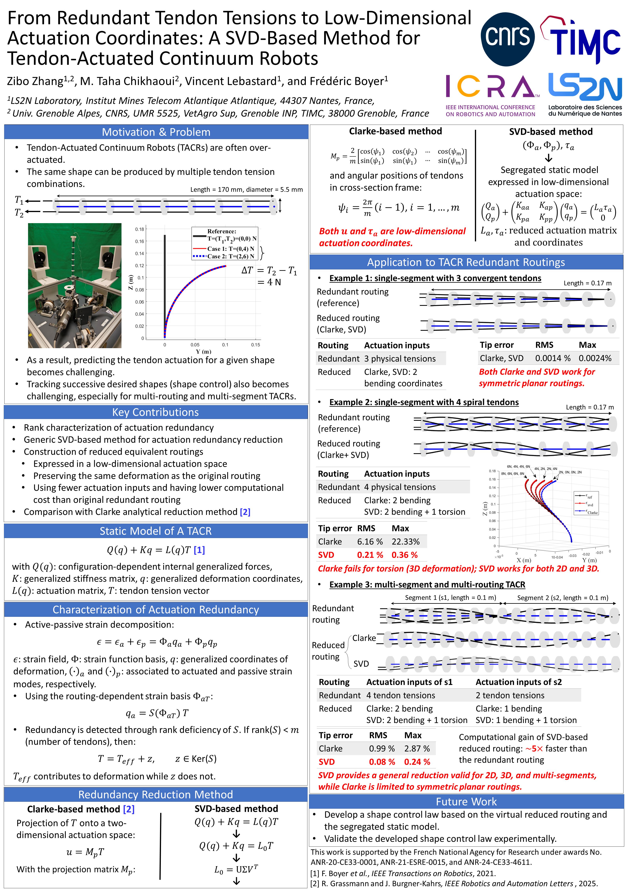
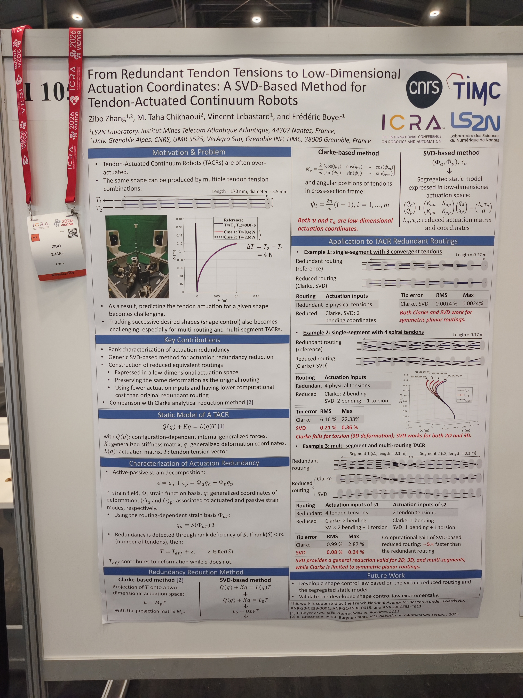

# From Redundant Tendon Tensions to Low-Dimensional Actuation Coordinates: A SVD-Based Method for Tendon-Actuated Continuum Robots

This repository hosts the core theoretical framework, analytical methods, and presentation materials for the **SVD-based actuation redundancy reduction method**. This work constitutes **Chapter 4** of my PhD dissertation (*Élimination et analyse de la redondance d'actionnement*) and was peer-reviewed and presented as a Workshop Poster at the **IEEE International Conference on Robotics and Automation (ICRA 2026)**, Vienna, Austria. The workshop theme is: _AI-Driven Soft Robotics: Innovations, Challenges, and Future Directions_

---

## 🖼️ Workshop Poster & Graphical Abstract

---

## 📌 Background & Research Motivation (PhD Thesis Ch. 4)
Tendon-Actuated Continuum Robots (TACRs) are inherently **over-actuated**. Due to the routing mechanics, the same spatial bending behaviour or trajectory can be produced by an infinite combination of internal tendon tensions. This implies actuation redundancy and may lead to:

1. **Mathematical Ill-posedness:** Hard to predict unique combination of tendon inputs for shape control. Predicting the tendon actuation for a given shape becomes challenging. Tracking successive desired shapes (shape control) also becomes challenging, especially for multi-routing and multi-segment TACRs.

2. **Computational Inefficiency:** Overhead in multi-segment and multi-routing forward/inverse kinematic simulations.

While historical methods (such as Clarke Transform-based reduction [1]) work well for symmetric 2D planar robots, they **may fail when handling 3D complex torsion or non-symmetric routings in single-/multi-segment**.

---

## 🚀 Key Contributions & Methodology
To bridge this gap, buding upon the work of [2], our work introduces a unified mathematical framework using **Singular Value Decomposition (SVD)** integrated with **Cosserat Rod Theory** and Lie groups ($SE(3)$). This framework enables a **Dimension Reduction:**, where the redundant, high-dimensional physical tendon tension space is projectively mapped into a minimal, non-redundant, low-dimensional virtual actuation coordinate system. In addition, this framework remains compatitble with 3D complex routing paths and 3D trosion. It captures 3D complex deformations (bending + twisting), unlocking capabilities where classical methods [1] fail. Meanwhile, by eliminating internal tension redundancies during iterative solver steps, the simulation speed is accelerated by approximately **500%**, facilitating real-time closed-loop force/position control. Moreover, this framework demonstrated a versatile performance on multi-routing, multi-segment continuum systems. 

Our futur work aims at the developement of a shape control law based on the virtual reduced routing and the segregated static model, and the experimental validation of the developed shape control law.

---

## 📊 Simulation Results
* **Example 1 (Planar Bending):** Achieved sub-millimeter tip tracking precision with unified coordinates.
* **Example 2 (3D Spiral Torsion):** Traditional Clarke reduction yielded a **22.33% Max Tip Error** due to missing torsional constraints. Our **SVD Method reduced the Max Tip Error to 0.36%**.
* **Real-Time Efficiency:** Forward modeling time reduced drastically, allowing high-frequency embedding.

---

## Reference
[1] R. Grassmann and J. Burgner-Kahrs, "Clarke Coordinates Are Generalized Improved State Parametrization for Continuum Robots" IEEE Robotics and Automation Letters, 2025. 
[2]  F. Boyer, V. Lebastard, F. Candelier, and F. Renda, “Dynamics of continuum and soft robots: A strain parameterization based approach,” IEEE Transactions on Robotics, vol. 37, no. 3, pp. 847–863, 2021.

---

## How to Cite
If you find this theory or method helpful for your continuum/soft robotics research, please cite our workshop paper or the corresponding PhD dissertation chapter:

@inproceedings{zhang2026svd,
  author    = {Zhang, Zibo and Chikhaoui, M. Taha and Lebastard, Vincent and Boyer, Fr{\'e}d{\'e}ric},
  title     = {From Redundant Tendon Tensions to Low-Dimensional Actuation Coordinates: A SVD-Based Method for Tendon-Actuated Continuum Robots},
  booktitle = {IEEE International Conference on Robotics and Automation (ICRA 2026) Workshop on AI-Driven Soft Robotics: Innovations, Challenges, and Future Directions},
  address   = {Vienna, Austria},
  month     = {June},
  year      = {2026}
}

@phdthesis{zhang2025modelisation,
  author  = {Zhang, Zibo},
  title   = {Mod{\'e}lisation, pr{\'e}diction de forme et {\'e}limination de la redondance d'actionnement dans les robots continus actionn{\'e}s par c{\^a}bles},
  school  = {IMT Atlantique / Universit{\'e} Grenoble Alpes},
  year    = {2025},
  note    = {Chapter 4: {\'E}limination et analyse de la redondance d'actionnement}
}

---

## Apprndix
The poster presented during the workshop session, on June 1st, at Vienna, Austria:

